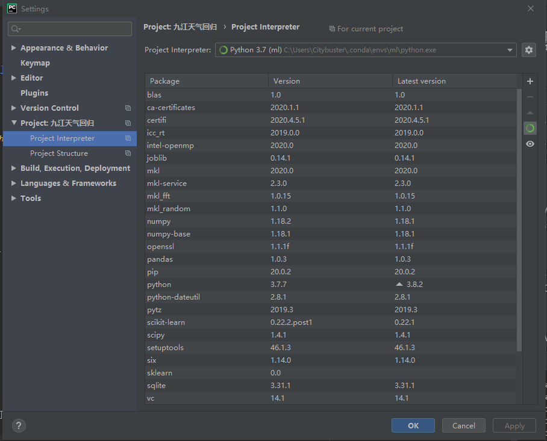

# 安装

整个文件仔细介绍了如何安装模型运行所需要的环境。

- 关于回归模型工作原理的介绍请参考, 请参考[`README.md`](README.md).

**需要：**

- Python管理器：[`anconda`](https://www.anaconda.com/)
- 代码编写IDE：[`Pycharm`](https://www.jetbrains.com/zh-cn/pycharm/promo/?utm_source=baidu&utm_medium=cpc&utm_campaign=cn-bai-br-pycharm-ex-pc&utm_content=pycharm-pure&utm_term=pycharm)

**注意：**

- 本项目在初始阶段仅仅安装了CPU版的XGBoost.

**安装：**

Windows下请打开Anaconda Prompt，Linux系统打开Terminal。输入一下安装命令：

```
conda create -n ml python=3.7
conda activate ml
pip install xgboost
pip install scikit-learn
pip install sklearn
```

**配置：**

将配置好的python环境添加到Pycharm中，具体的操作流程，可以参考[`这个`](https://blog.csdn.net/m0_43505377/article/details/102997178)链接。配置好后的示意图如下：

