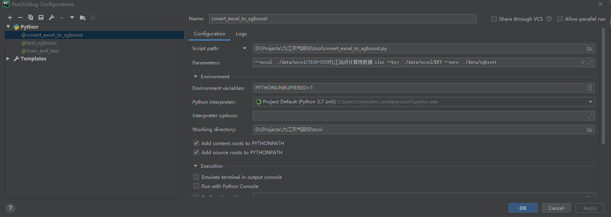
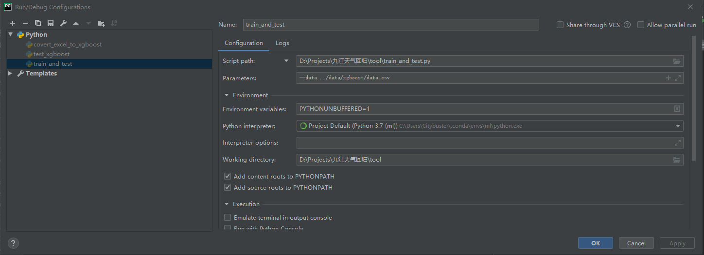

## 基于XGBoost的回归预测

### 介绍
整个工程是基于决策树框架[`XGBoost`](https://xgboost.readthedocs.io/en/latest/),构建的回归模型。如果你想用好这个框架的话，我建议你首先学习一下经典的决策树数算法，如ID3和CART，然后再深入学习一下XGBoost的工作原理。具体的阅读链接如下，请按照顺序月的：

1. 李航《统计学习方法》中有关决策树的章节；
2. 官方的有关[`XGBoost`](https://xgboost.readthedocs.io/en/latest/tutorials/index.html)的教程(tutorial)；
3. 还有一些写的比较好的博客，我放在了项目工程中的reference的决策树文件夹中。

另外整个工程的代码编写方式参考了FaceBook的目标检测框架[`Detectron`](https://github.com/facebookresearch/Detectron)。主要包括的文件夹有：

1. citybuster：主要用来存放各种编写的Python类以及函数。本项目目前仅仅添加了一个日志系统([`./citybuster/utils/logging.py`](./citybuster/utils/logging.py))，方便记录代码实执行过程中产生的日志信息；
2. data：存放具体原始的Excel数据，以及转换后方便使用的CSV格式的数据；
3. log：存放Log信息；
4. reference：编写本工程以及设计算法时，所涉及的参考资料；
5. requirement：甲方书写的需求文档
6. tool：数据转换，模型训练的"main"函数。类别C++工程，就是[`citybuster`](citybuster)存放的是项目定义的头文件以及源文件位置，而[`tool`](tool)是主函数接口。这个目的主要为了实现解耦，当然本项目在初始阶段将模型训练的算法逻辑也写在了主函数"train_and_test.py"中，这个其实是不可取的。建议以后新添加的函数放在[`citybuster`](citybuster)下。

### 天气回归模型设计思想

整个决策树模型仅仅利用了一个时刻的数据进行输入，分别训练两个决策树模型，一个预测高温，一个预测低温。另外，文件`./data/excel/KEY`存放了实际训练过程中所用到的输入数据属性。关于数据的准备，建议一律采取英文的书写方式，不要出现中文，包括文件名。

### 模型运行环境安装

关于模型运行所需要的环境如何搭建，请参考这个[`INSTALL.md`](README.md)

### 模型执行

整个算法的执行流程主要分为两个部分：数据集的准备以及模型的训练与测试。关于数据集的准备，请按照文件`./data/excel/2018-2019九江站点计算用数据.xlsx`的格式组织excel文件。两个代码的执行所需要的环境配置文件如下所示，然后点击运行或者调试，即可执行代码。

数据准备：

训练与测试模型：

### 拓展

在考虑算法方案的过程中，我除了考虑XGBoost以外。还认为其它的方法可能对预测精度有帮助。主要包括：时间序列方法以及循环神经网络。另外关于如何提升XGBoost的精度，主要分为两个大的方面：特征工程和调参。

### 时间序列

关于时间序列的内容我建议阅读一下这个Kaggle[`博客`](https://www.kaggle.com/thebrownviking20/everything-you-can-do-with-a-time-series)。时间序列模型主要考虑到了时许之间的相关性，和贝叶斯理论相关，可以类比马尔可夫模型。

### 循环神经网络

循环神经网络非常善于处理时许信号，配合卷积神经网络可以实现强大的特征表达。这个[`github`](https://github.com/tgjeon/TensorFlow-Tutorials-for-Time-Series)链接给出了一些例子。另外，如果你没有循环神经网络的基础，建议阅读一下**Pytorch**的[`官网教程`](https://pytorch.org/tutorials/)。个人认为循环神经网络是一个非常可行的方向，只不过需要大量的调参。

